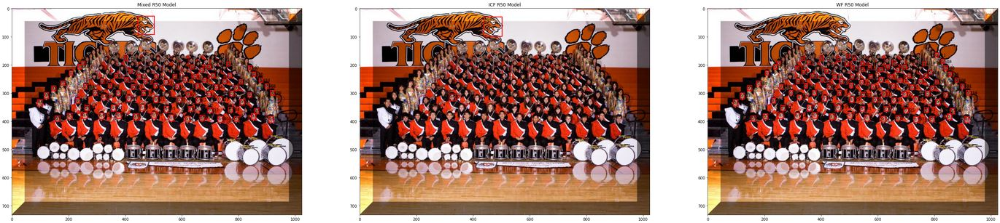

# FaceDetector

A face detector model for both real-life and comic images based on RetinaFace model.

## Requirements

- PyTorch > 1.7
- CUDA 11

## Results

The models are trained for 60 epochs and their average precision (AP) results are testeds on different datasets from different domains:

- [WIDER FACE](http://shuoyang1213.me/WIDERFACE/)
- [iCartoonFace](https://github.com/luxiangju-PersonAI/iCartoonFace)
- [Manga109](http://www.manga109.org/en/): 
- 
- No face detection benchmark was present for Manga109, so the data is randomly divided and a test data is constructed.

R50 or R152 means that the model is trained either with the backbone ResNet50 or ResNet152. WF means the model is traned only with the WIDER FACE data, ICF means the same for iCartoonFace data and for the Mixed case, both of the datasets are used for training.

Model       | WF Easy | WF Medium | WF Hard | ICF Val. | Manga109 |
---         | ---     | ---       | ---     |---       |---       |
WF-R50      | 0.9365  | 0.9197    | 0.7897  | 0.1501   | 0.2696   | 
ICF-R50     | 0.7091  | 0.6239    | 0.3387  | 0.8273   | 0.8309   | 
Mixed-R50   | 0.9111  | 0.8898    | 0.7310  | 0.7403   | 0.7212   |
Mixed-R152  | 0.9119  | 0.8829    | 0.7205  | 0.7421   | 0.7527   |

## Notes

Check the notebook file or the makefile to train, predict and evaluate the models.

## Pretrained Weights

[Drive Link](https://drive.google.com/drive/folders/11Kxzz4EnorI6uA6HK9x-UH_5BrQyXlBW?usp=sharing)

## Sample Image Results

### WIDERFACE

### iCartoonFace

### Golden Age Comics

### Manga109

### Custom Data

